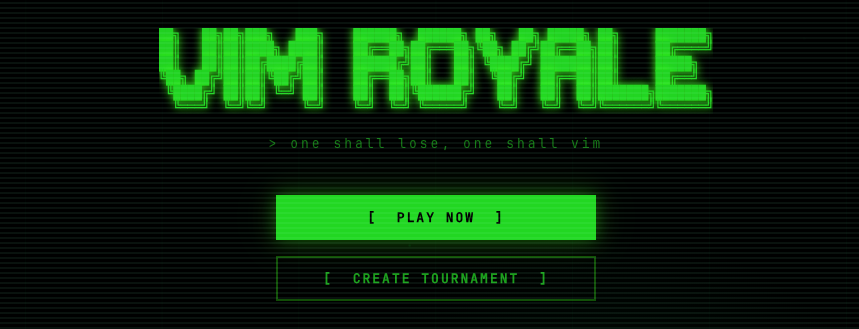

<div align="center">
    <a href="https://peerlist.io/jitesh117/project/vim-royale" target="_blank" rel="noreferrer">
        
    </a>
</div>


## About

Vim Royale is a pvp vim based multiplayer game. Users can play 1v1 matches against each other and compete for a spot on the leaderboard. The game uses AI to generate random code snippets for players to edit and compete on. Users can sign in with Google to save their progress and compete on the leaderboard. 

## Features
- 1v1 matches with real-time updates
- Rating system based on Elo
- Spectator mode for matches
- Create and join custom lobbies with your friends
- Match replay to analyse your movies
- Built-in VimTutor
- Leaderboard to compete for a spot
- Code snippets for players to edit and compete on

## Tech Stack

- Frontend: React, TypeScript, Vite, CodeMirror
- Backend: Go, Gin, WebSockets, GORM
- Database: PostgreSQL
- Auth: Google/GitHub OAuth

## Want to Contribute?

Refer to [CONTRIBUTING.md](./CONTRIBUTING.md)

## Security

Refer to [SECURITY.md](./SECURITY.md)

## Running Locally

```bash
cd backend && docker compose -f docker-compose.dev.yml up --build   
```

```bash
cd frontend && npm install && npm run dev
```
